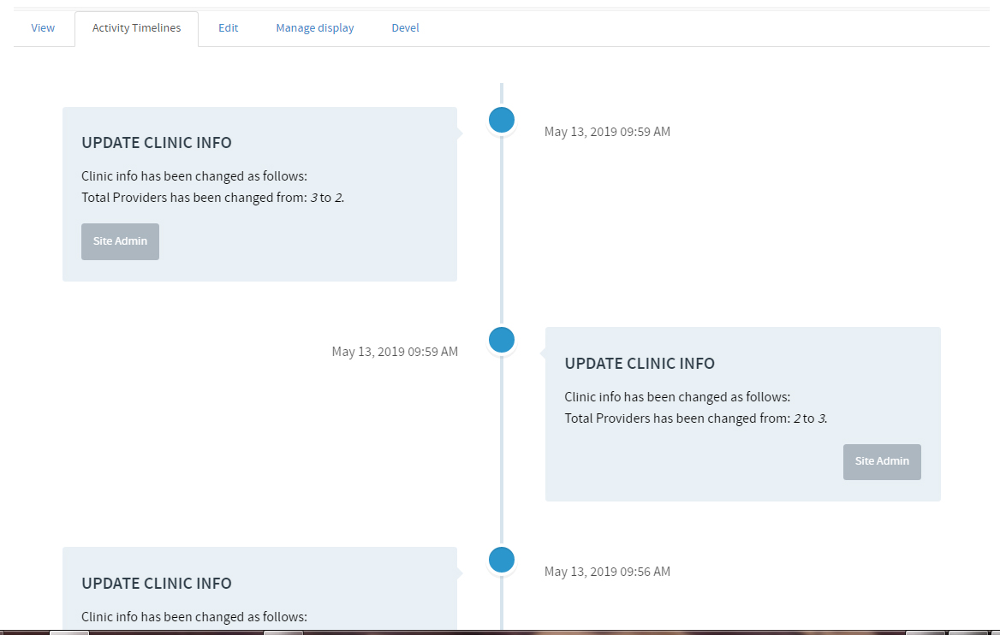

# Elastic Activity Timeline
Display timeline with elastic expand

This is an exmple, how you can implement elastic timeline display when you scroll down the page.
This is based on Drupal 7.

You can add the log, by calling:
<code>activity_log($type, $title, $message, $nid, $uid)</code>

$type: Type of log 
$title: Title to display about the log 
$message: Detail of the log 
$nid: Node ID 
$uid: Optionally user id. If not provided, will add current logged in user id. 

Activity logs will auto load when user scroll down. User can view the log using the url <code>/activitylogs/{type}</code>

--------------------------------------------------------------------------------------
You can contact me at:
<strong>Shafiq Hossain</strong>
<em>md.shafiq.hossain@gmail.com</em>
